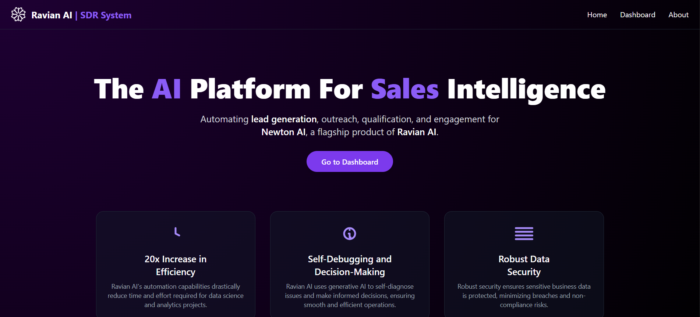
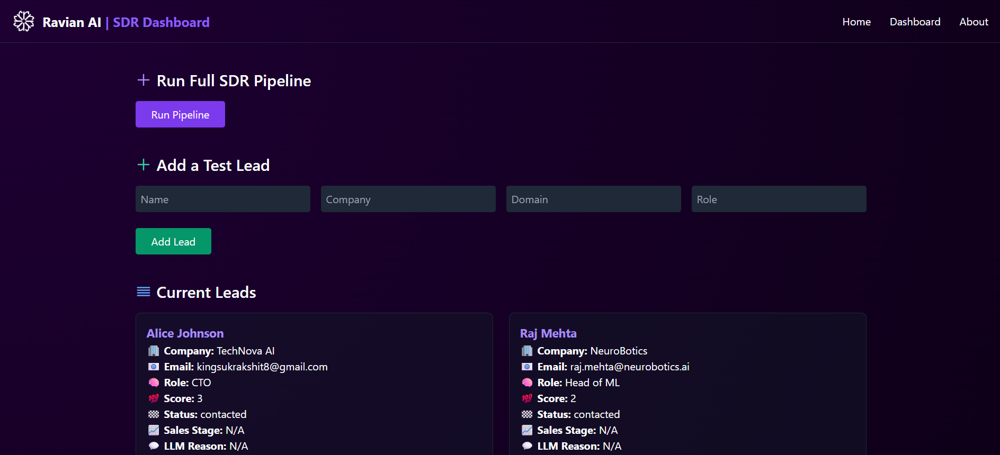
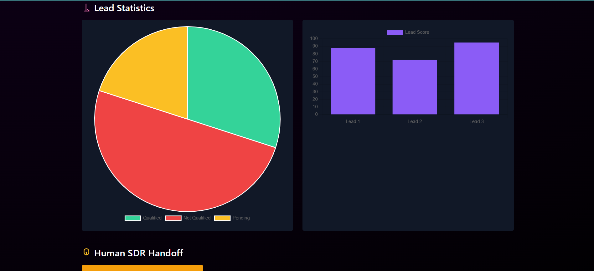
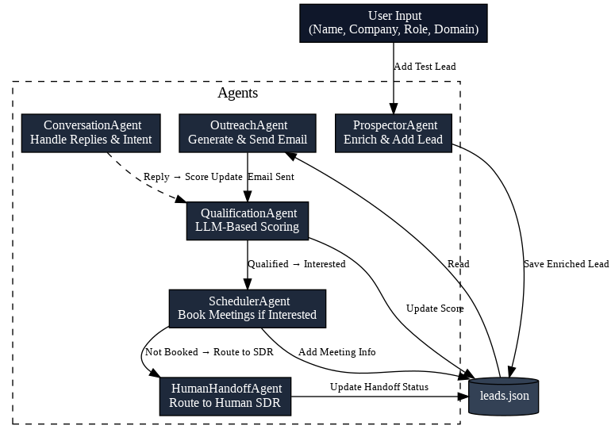

# 🚀 The AI Platform for Sales Intelligence

An intelligent, multi-agent platform designed to automate lead sourcing, personalized outreach, qualification, and meeting scheduling. Built using Flask, TailwindCSS, and OpenAI-powered agents, this system acts as an AI Sales Development Representative (SDR) with human-in-the-loop capabilities.

---

## 🧠 Overview

The platform automates the full sales engagement lifecycle using a modular agent-based workflow:

- 🔍 **Prospector Agent** — finds and enriches leads  
- ✉️ **Outreach Agent** — crafts and sends cold emails  
- ✅ **Qualification Agent** — scores leads using ICP criteria  
- 💬 **Conversation Agent** — handles email replies with LLMs  
- 📅 **Scheduler Agent** — books meetings with qualified leads  
- 🧑‍💼 **Human Handoff Agent** — routes promising leads to human SDRs

The system can be run in headless mode or via a web UI (Flask + TailwindCSS) designed to reflect Ravian AI's brand.

---

## 🖼️ UI Preview

### 🏠 Home Page


### 📋 Dashboard


### 📊 Charts (Lead Breakdown)


### 🔄 Agent Workflow Diagram



---

## 🧱 Project Structure


```

autogen\_sdr\_project/
├── agents/
│   ├── prospector\_agent.py          # Lead sourcing & enrichment
│   ├── outreach\_agent.py            # Email generation & sending
│   ├── qualification\_agent.py       # Lead scoring using ICP
│   ├── human\_handoff\_agent.py       # Notifies human SDRs
│   ├── conversation\_agent.py        # Handles replies (LLM-based)
│   └── scheduler\_agent.py           # Schedules meetings
│
├── workflows/
│   └── lead\_pipeline.py             # Full agent workflow execution
│
├── ui/
│   └── main.py                      # Streamlit version (for dev/testing)
│
├── data/
│   ├── newton\_product\_info.md       # Context for LLM agents
│   ├── leads.json                   # Local CRM of all lead statuses
│   └── logs/
│       └── events.logs              # Pipeline logs
│
├── prompts/
│   ├── cold\_email\_prompt\_templates.py
│   ├── scoring\_prompt\_templates.py
│   └── **init**.py
│
├── enrichment/
│   └── lead\_sources.py              # LinkedIn/Skrapp/others
│
├── utils/
│   ├── gmail\_utils.py               # Sends email via Gmail SMTP
│   ├── enrichment\_utils.py          # Adds job title, industry, domain
│   └── logger.py                    # Structured logging
│
├── templates/                      # Flask UI
│   ├── home.html
│   ├── dashboard.html
│   └── handoff.html
│
├── static/                         # Brand assets & screenshots
│   ├── logo.png
│   └── images/
│       ├── home.png
│       ├── dashboard.png
│       ├── charts.png
│       └── workflow\.png
│
├── app.py                          # Flask backend
├── config.py                       # Centralized config loader
├── .env                            # API keys, SMTP credentials
├── requirements.txt                # Project dependencies
└── README.md                       # This file

````

---

## ⚙️ How It Works (Agent Workflow)

```mermaid
graph LR
    A[ProspectorAgent] --> B[OutreachAgent]
    B --> C[QualificationAgent]
    C --> D[ConversationAgent]
    D --> E[SchedulerAgent]
    C --> F[HumanHandoffAgent]
````

* **ProspectorAgent**: Sources leads and enriches them using public APIs or manual input.
* **OutreachAgent**: Uses prompt templates to create cold emails personalized with Newton AI product info.
* **QualificationAgent**: Uses LLM scoring based on ICP rules to tag leads as qualified or not.
* **ConversationAgent** *(optional)*: Handles and classifies replies like “interested”, “not interested”, “follow up”.
* **SchedulerAgent** *(optional)*: Books meetings via Calendly or similar links.
* **HumanHandoffAgent**: Sends high-quality leads to human reps for final action.

---

## 🛠️ Tech Stack

| Layer             | Tech Used                          |
| ----------------- | ---------------------------------- |
| Backend Framework | Flask 3.1.1                        |
| Frontend Styling  | TailwindCSS (via CDN)              |
| Language Model    | OpenAI GPT-4o / Azure OpenAI       |
| Email Handling    | Gmail SMTP (via yagmail)           |
| Data Enrichment   | Custom + Skrapp.io + Clearbit APIs |
| Logging           | Loguru                             |
| Task Runner       | Gunicorn (optional deployment)     |
| Dev UI            | Streamlit (dev only)               |

---

## 🚀 Setup Instructions

1. **Clone the repo**

```bash
git clone https://github.com/Kingsuk-rakshit/AI-SDR-System.git
cd autogen_sdr_project
```

2. **Create virtual environment and install dependencies**

```bash
python -m venv env
source env/bin/activate    # Windows: env\Scripts\activate
pip install -r requirements.txt
```

3. **Set up `.env` file**

Create a `.env` file at the root:

```
OPENAI_API_KEY=your_openai_key
AZURE_DEPLOYMENT_ID=your_deployment
GMAIL_USER=your_email@gmail.com
GMAIL_APP_PASSWORD=your_gmail_app_password
```

4. **Run the Flask Web UI**

```bash
python app.py
```

Visit: [http://localhost:5000](http://localhost:5000)

---

## 🧪 Example Flow

1. Add test leads manually or through the Prospector Agent
2. Click "Run Pipeline" to trigger:

   * LLM-generated cold emails
   * Lead scoring and enrichment
   * Meeting scheduling and handoff
3. Track lead progress via the Dashboard

---

## 🧩 Customization Ideas

* 🔌 Replace Gmail with Gmail API or SendGrid
* 🌍 Add Hubspot/Zoho CRM sync
* 🧾 Integrate Stripe payment links for self-serve
* 📅 Use Calendly or Google Calendar API
* 🧑‍💻 Extend LLM reply handling for conversational follow-ups

---

## 📄 License

This project is proprietary and intended for internal use by Ravian AI. For commercial inquiries or collaboration, please contact [Reachus@ravian.ai](mailto:Reachus@ravian.ai)

---

## 🙌 Acknowledgments

Thanks to the entire Ravian AI team for product insights, LLM feedback, and SDR workflows. Built with ❤️ by Kingsuk Rakshit.

```
